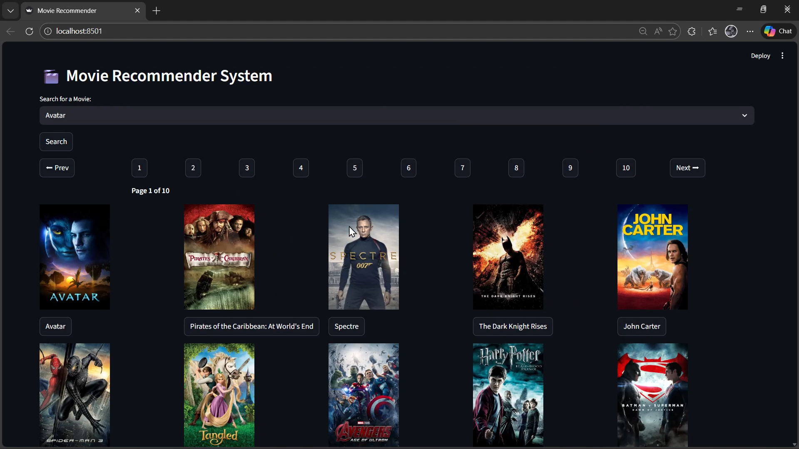

#  Movie Recommender System (Content-Based)

An end-to-end **AI-powered Movie Recommendation System** that suggests similar movies based on user selection using **Content-Based Filtering**.

---

##  Project Goal

The goal of this project is to build an intelligent recommendation engine that analyzes movie metadata and suggests **top similar movies** instantly.

Instead of relying on user ratings (collaborative filtering), this system focuses on **movie content** such as:

* Genres
* Cast
* Crew
* Keywords
* Overview

---

##  How It Works (Technical Overview)

### 1. Data Processing

* Combined datasets:

  * `tmdb_5000_movies.csv`
  * `tmdb_5000_credits.csv`
* Merged on `id`
* Selected important features:

  * Title, Overview, Genres, Keywords, Cast, Crew

---

### 2. Feature Engineering

* Extracted:

  *  **Director** from crew
  *  **Top 3 actors** from cast
* Cleaned text (removed spaces in names)
* Created a **"tags" column** by combining all features
* Applied **PorterStemmer** for normalization

---

### 3. Vectorization

* Used **CountVectorizer (Bag of Words)**
* Converted text into **5000-dimensional vectors**
* Removed English stop words

---

### 4. Similarity Calculation

* Used **Cosine Similarity**
* Measures similarity between movies based on vector distance

---

### 5. Web Application (Streamlit)

Interactive UI with:

*  Movie search
*  Pagination (500 movies/page)
*  Movie details:

  * Poster
  * Rating
  * Genres
  * Overview
*  Top 15 similar movie recommendations

---

##  Project Structure

```
Movie-Recommender-System/
│
├── 1_Data/
│   ├── tmdb_5000_movies.csv
│   └── tmdb_5000_credits.csv
│
├── 2_Notebooks/
│   ├── Movie.ipynb
│   └── requirements.txt
│
├── 3_Models/
│   ├── movies_with_full_details.pkl
│   └── similarity.pkl
│
├── 4_Streamlit_web_App/
│   ├── app.py
│   └── requirements.txt
│
├── 5_project_Video/
│   └── demo.mp4
│
└── README.md
```

---

##  Installation & Setup

Follow these steps to run the project locally:

### 1. Clone the Repository

```bash
git clone <https://github.com/MubashirShafique/Movie-Recommender-System.git>
cd Movie-Recommender-System
```

---

### 2. Navigate to Streamlit App Folder

```bash
cd 4_Streamlit_web_App
```

---

### 3. Install Requirements

```bash
pip install -r requirements.txt
```

---

### 4. Run the Application

```bash
streamlit run app.py
```

---

### 5. Open in Browser

Streamlit will automatically open:

```
http://localhost:8501
```

---

##  Requirements

Main libraries used:

* pandas
* numpy
* scikit-learn
* nltk
* streamlit
* requests

---

##  Key Features

✔ Content-Based Filtering
✔ Fast recommendations using precomputed similarity
✔ Clean and interactive UI
✔ Real-time movie search
✔ Detailed movie insights

---

##  Future Improvements

* Add **Collaborative Filtering**
* Integrate **User Login System**
* Use **Deep Learning (NLP embeddings)**
* Deploy on cloud (Streamlit Cloud / AWS)

---

##  Preview

Below is the homepage of the application:


---

##  Contribution

Feel free to fork this repository and improve it. Contributions are always welcome!

---

##  Author

**Muhammad Mubashir Shafique (Gamma)**
BS Computer Science Student 
